# GitHub + Linear Integration Workflow [Complete Guide]

## Sub-Issue Support

## System Architecture Diagram

```mermaid
graph TB
    subgraph "Developer Environment"
        DEV[Developer]
        LG_CLI[lg CLI<br/>TypeScript Implementation]
        GH_CLI[gh CLI]
    end
    
    subgraph "GitHub"
        GH_ISSUE[GitHub Issues<br/>Parent Issue]
        GH_SUB[GitHub Sub-Issues<br/>Child Issue]
        GH_PR[GitHub Pull Requests]
        GH_PROJECT[GitHub Projects<br/>WED-7038A<br/>RADAR-7104Y<br/>UGEC-7014A<br/>QMA-7106A]
    end
    
    subgraph "Linear"
        LINEAR_SYNC[Linear GitHub<br/>Issues Sync<br/>★Sub-issue Support★]
        LINEAR_PARENT[Linear Parent Issues]
        LINEAR_SUB[Linear Sub-Issues]
        LINEAR_PROJECT[Linear Projects<br/>WED-7038A<br/>RADAR-7104Y<br/>UGEC-7014A<br/>QMA-7106A]
        LINEAR_API[Linear API]
    end
    
    DEV -->|Create Parent Issue| LG_CLI
    DEV -->|Create Sub-Issue| LG_CLI
    
    LG_CLI -->|gh issue create| GH_CLI
    LG_CLI -->|gh api graphql<br/>addSubIssue| GH_CLI
    
    GH_CLI -->|Create Parent Issue| GH_ISSUE
    GH_CLI -->|Create Sub-Issue<br/>+ Set Parent-Child Relationship| GH_SUB
    
    GH_ISSUE -.->|Auto Sync<br/>title, description<br/>status, labels<br/>assignee| LINEAR_SYNC
    GH_SUB -.->|Auto Sync<br/>★Parent-Child Relationship Also Synced★| LINEAR_SYNC
    
    LINEAR_SYNC -.->|Create Parent Issue| LINEAR_PARENT
    LINEAR_SYNC -.->|Create Sub-Issue<br/>+ Maintain Parent-Child Relationship| LINEAR_SUB
    
    LG_CLI -->|Direct Linear API Call<br/>Set due date & project| LINEAR_API
    LINEAR_API -->|Update| LINEAR_PARENT
    LINEAR_API -->|Update| LINEAR_SUB
    
    LINEAR_PARENT -.->|Link to Project| LINEAR_PROJECT
    LINEAR_SUB -.->|Link to Project| LINEAR_PROJECT
    
    style LINEAR_SYNC fill:#e1f5ff
    style LG_CLI fill:#d4edda
    style LINEAR_API fill:#fff3cd
```



## Linear GitHub Issues Sync - Synchronized Fields

| Field | Sync | Bidirectional | Notes |
|------|------|---------------|-------|
| Title | ✓ | ✓ | |
| Description | ✓ | ✓ | |
| Status | ✓ | ✓ | GitHub Project custom statuses are not synced |
| Assignee | ✓ | ✓ | GitHub account connection required on Linear side |
| Labels | ✓ | ✓ | |
| **Sub-issues** | **✓** | **✓** | **Multi-level & Cross-repository/Team Support** |
| Comments | ✓ | ✓ | Comments outside Linear sync thread are not synced |
| Due Date | ✗ | ✗ | Set directly via Linear API by `lg` CLI tool |
| Project | ✗ | ✗ | Set directly via Linear API by `lg` CLI tool |

### Important Sub-Issue Sync Specifications

**✅ Supported Features:**
- Multi-level hierarchy (up to 8 levels)
- Cross-repository support
- Cross-team support

**⚠️ Limitations:**
- If parent issue is not a sync target (different repository/team), sub-issue is synced but parent issue is not set on the other side

## Complete Workflow Diagram

```mermaid
sequenceDiagram
    actor Dev as Developer
    participant LG as lg CLI
    participant GH_CLI as gh CLI
    participant Parent as GitHub Parent Issue
    participant Sub as GitHub Sub-Issue
    participant GH_Proj as GitHub Project
    participant Sync as Linear Issues Sync
    participant L_Parent as Linear Parent Issue
    participant L_Sub as Linear Sub-Issue
    participant LAPI as Linear API
    participant L_Proj as Linear Project
    
    Note over Dev,L_Proj: Phase 1: Create Parent Issue
    
    Dev->>LG: lg create-parent<br/>"GraphQL Learning" "2025-12-31"<br/>"Description" "WED-7038A"
    LG->>GH_CLI: gh issue create
    GH_CLI->>Parent: Create Issue #123
    Parent->>GH_Proj: Link to Project
    
    Parent-->>Sync: Webhook
    Sync-->>L_Parent: Create Linear Issue<br/>title, description, status<br/>labels, assignee
    
    LG->>LG: Wait 5 seconds
    LG->>LAPI: Find issue by GitHub URL
    LAPI-->>LG: Linear issue ID
    LG->>LAPI: Update metadata<br/>(due date & project)
    LAPI->>L_Parent: Update Complete
    L_Parent->>L_Proj: Link to Project
    
    Note over Dev,L_Proj: Phase 2: Create Sub-Issue (Auto Parent-Child Sync)
    
    Dev->>LG: lg create-sub<br/>123 "Basics" "2025-12-20"
    LG->>GH_CLI: gh issue create
    GH_CLI->>Sub: Create Sub-Issue #124
    LG->>GH_CLI: gh api graphql<br/>addSubIssue
    GH_CLI->>Parent: Set Parent-Child Relationship ★
    Sub->>GH_Proj: Inherit Project
    
    Sub-->>Sync: Webhook
    Parent-->>Sync: Detect Parent-Child Relationship ★
    Sync-->>L_Parent: Find Existing Parent Issue
    Sync-->>L_Sub: Create Sub-Issue<br/>+ Set Parent-Child Relationship ★
    
    LG->>LG: Wait 5 seconds
    LG->>LAPI: Find issue by GitHub URL
    LAPI-->>LG: Linear issue ID
    LG->>LAPI: Update metadata<br/>(due date & project)
    LAPI->>L_Sub: Update Complete
    L_Sub->>L_Proj: Link to Project
    
    Note over L_Parent,L_Sub: ✓ Complete Sync Finished (Including Parent-Child Relationship)
```



## Main Workflow (Sub-Issue + Draft PR)


## CLI Tool Implementation

### `lg` CLI Tool (TypeScript Implementation)

The current implementation uses the `lg` CLI tool (TypeScript) to create issues.

**Installation:**

```bash
cd scripts/linear-github
npm install -g .
```

**Usage:**

```bash
# Create parent issue
lg create-parent
# or
lg parent

# Create sub-issue
lg create-sub
# or
lg sub
```

**Features:**

- ✅ Interactive repository selection
- ✅ Project autocomplete (GitHub & Linear)
- ✅ Parent issue selection (when creating sub-issue)
- ✅ GitHub label selection
- ✅ Due date input
- ✅ Linear sync wait (5 seconds)
- ✅ Automatic due date & project setting via Linear API

See `README.md` for details.

## Complete Workflow Example

### Scenario: GraphQL Learning Project

```bash
# 1. Create parent issue
lg create-parent

# Interactive prompts:
# - Repository: owner/repo
# - Title: GraphQL Complete Mastery
# - Description: Learn GraphQL from basics to practical usage
#   ## Goals
#   - Understand GraphQL basic concepts
#   - Practical schema design
#   - Performance optimization
# - Due date: 2025-12-31
# - GitHub labels: to do, learning
# - GitHub project: WED-7038A
# - Linear project: WED-7038A

# → GitHub Issue #123 is created
# → Auto-synced to Linear (parent issue)
# → CLI tool sets due date & project

# 2. Create sub-issue (basics)
lg create-sub

# Interactive prompts:
# - Repository: owner/repo
# - Parent issue: #123 (GraphQL Complete Mastery)
# - Title: GraphQL Basics
# - Description: ## Tasks
#   - [ ] Read GraphQL official documentation
#   - [ ] Understand difference between queries and mutations
#   - [ ] Learn Schema Definition Language (SDL)
#   - [ ] Practice basic queries
# - Due date: 2025-12-15
# - GitHub labels: to do, learning
# - Linear project: (inherited from parent)

# → GitHub Sub-Issue #124 is created
# → Auto-synced to Linear (sub-issue, parent-child relationship maintained)
# → CLI tool sets due date & project

# 3. Create sub-issue (practice)
lg create-sub

# Interactive prompts:
# - Parent issue: #123
# - Title: GraphQL Practice
# - Description: ## Tasks
#   - [ ] Design sample API schema
#   - [ ] Implement resolvers
#   - [ ] Understand and address N+1 problem
#   - [ ] Implement DataLoader
# - Due date: 2025-12-22
# - GitHub labels: to do, coding

# → GitHub Sub-Issue #125 is created
# → Auto-synced to Linear (sub-issue, parent-child relationship maintained)
```

### Starting Work (Draft PR Workflow)

```bash
# Start work on Sub-Issue #124
git switch -c username/LEA-124-graphql-basics

# Commit empty commit or initial changes
git commit --allow-empty -m "feat: LEA-124 GraphQL Basics" -m "solve: #124"
git push origin username/LEA-124-graphql-basics

# Create draft PR
gh pr create --draft --fill
# Title: LEA-124 GraphQL Basics
# Body: solve: #124
# → Linear: Todo

# Continue learning
# Read documentation, take notes

# Record progress in comments
gh issue comment 124 --body "## Progress (2025-12-10)
- ✅ Read GraphQL official documentation chapters 1-3
- ✅ Understand basics of queries and mutations
- 🔄 Learning SDL (50% complete)

## What I Learned
- GraphQL complements REST, doesn't replace it
- Importance of type system
- Solving over-fetching/under-fetching problems

## Next Steps
- Complete SDL learning
- Practice basic queries"

# → This comment is also auto-synced to Linear

# When work progresses, mark PR as ready
gh pr ready
# → Linear: In Progress
```

### Completion and PR Merge

```bash
# Document learning notes
echo "# GraphQL Basics Learning Notes

## Learning Content
...
" > docs/graphql-basics.md

git add docs/graphql-basics.md
git commit -m "docs: Add GraphQL basics learning notes"
git push

# Merge PR
gh prms  # or gh pr merge --squash --delete-branch

# → GitHub Issue #124 is automatically closed
# → Linear is also automatically set to Done
# → Parent Issue #123 sub-issue progress is updated
```

### After All Sub-Issues Complete

```bash
# When the last Sub-Issue #126 PR is merged...

gh prms  # PR for #126

# → Sub-Issues #124, #125, #126 are all Done
# → Parent Issue #123 is also automatically Done on Linear side (depending on settings)
# → Project complete!
```

## Troubleshooting

### 1. Linear issue not found yet

**Causes:**
- Linear sync delay (usually 5-10 seconds)
- GitHub URL not set correctly

**Solutions:**

```bash
# CLI tool automatically waits 5 seconds, but if still not found
# Manually check GitHub URL in Linear
# Or try running again
```

### 2. Sub-Issue not created

**Causes:**
- GraphQL API call error
- Parent issue doesn't exist

**Solutions:**

```bash
# Check if parent issue exists
gh issue view 123

# Set parent-child relationship directly via GraphQL API
PARENT_ID=$(gh issue view 123 --json id --jq ".id")
CHILD_ID=$(gh issue view 124 --json id --jq ".id")

gh api graphql \
  -H "GraphQL-Features: sub_issues" \
  -f query="
    mutation {
      addSubIssue(input: {
        issueId: \"$PARENT_ID\",
        subIssueId: \"$CHILD_ID\"
      }) {
        issue { title }
        subIssue { title }
      }
    }
  "
```

### 3. Parent-child relationship not showing on Linear

**Causes:**
- Linear sync delay (usually 5-10 seconds)
- Parent issue not synced to Linear
- Issues from different repositories/teams

**Solutions:**

```bash
# 1. Wait a bit (10-15 seconds)
sleep 15

# 2. Check parent issue in Linear
# Check "Sub-issues" section in Linear

# 3. Verify parent issue is in same repository/team
```

### 4. Due date or Project not set

**Causes:**
- Linear API key not set
- Linear sync not complete (5 second wait insufficient)

**Solutions:**

```bash
# Check if LINEAR_API_KEY is set
echo $LINEAR_API_KEY

# If not set
export LINEAR_API_KEY="lin_api_..."

# Re-run CLI tool
lg create-parent  # or lg create-sub

# If still not set, set manually in Linear
```

## Best Practices

### 1. Issue Structure Design

**Recommended:**

```
Parent Issue: Large feature or epic
├── Sub-Issue 1: Design phase
├── Sub-Issue 2: Implementation phase
├── Sub-Issue 3: Testing phase
└── Sub-Issue 4: Documentation creation
```

**Avoid:**

```
Parent Issue: Small task
└── Sub-Issue: Even smaller task (excessive breakdown)
```

### 2. PR Creation Workflow

#### Recommended: Draft PR → Ready → Merge

```bash
# 1. Create draft PR immediately after branch creation
git switch -c username/LEA-124-task
git commit --allow-empty -m "feat: LEA-124 Task" -m "solve: #124"
git push
gh pr create --draft --fill
# → Linear: Todo

# 2. Mark as ready when starting work
gh pr ready
# → Linear: In Progress

# 3. Merge when complete
gh prms
# → Linear: Done, GitHub: Closed
```

See `workflow.md` for details.

### 3. Label Strategy

```bash
# Phase labels
"to do", "in progress", "review", "done"

# Type labels
"feat", "fix", "chore", "docs", "refactor", "test", "research"

# Priority labels
"priority: high", "priority: medium", "priority: low"

# Project-specific
"WED-7038A", "RADAR-7104Y", etc.
```

### 4. Due Date Management

```bash
# Parent issue: Overall project deadline
lg create-parent  # Due date: 2025-12-31

# Sub-issues: Milestone deadlines
lg create-sub  # Parent: #123, Due date: 2025-12-10
lg create-sub  # Parent: #123, Due date: 2025-12-20
lg create-sub  # Parent: #123, Due date: 2025-12-30
```

### 5. Commit Messages

```bash
# Good examples
git commit -m "feat(LEA-124): Add GraphQL basics learning documentation"
git commit -m "docs(LEA-125): Create resolver implementation guide"

# Avoid
git commit -m "update"
git commit -m "fix"
```

### 6. PR Body

```markdown
# Good example
solve: #124

## Changes
- Completed GraphQL basics learning
- Created learning notes documentation

## Review Points
- Review documentation content
- Verify sample code works

# Avoid
solve: #124

done
```

## Summary

### ✅ Benefits of This Integration System

1. **Create Sub-Issue Structure on GitHub → Auto-sync to Linear**
   - Parent-child relationships fully maintained
   - Multi-level hierarchy support

2. **Consistent Operation with `lg` CLI Tool**
   - `lg create-parent`: Create parent issue
   - `lg create-sub`: Create sub-issue
   - Interactive and easy to use
   - Automatically sets due date & project

3. **Draft PR Workflow**
   - Create draft PR early (Linear: Todo)
   - Mark ready when starting work (Linear: In Progress)
   - Complete on merge (Linear: Done)

4. **Visualization on Linear**
   - View sub-issue progress from parent issue
   - Reference parent issue from sub-issue
   - Track overall project progress

5. **Full Bidirectional Sync**
   - Works from both GitHub and Linear
   - Comments, status, labels all synced

### 🚀 Recommended Workflow

```
1. Large task occurs
   ↓
2. Create parent issue (lg create-parent)
   ↓
3. Break down task and create sub-issues (lg create-sub × N)
   ↓
4. Start work on each sub-issue (create branch)
   ↓
5. Create draft PR (Linear: Todo)
   ↓
6. Mark PR ready when starting work (Linear: In Progress)
   ↓
7. Record progress in comments (bidirectional sync)
   ↓
8. Merge PR when complete (gh prms)
   ↓
9. Auto-close on merge (Linear side also Done)
   ↓
10. Parent issue also completes when all sub-issues done
```

### 📚 References

- [GitHub Sub-Issues Documentation](https://docs.github.com/en/issues/tracking-your-work-with-issues/using-issues/adding-sub-issues)
- [Linear GitHub Integration](https://linear.app/integrations/github)
- [Linear Sub-Issues Documentation](https://linear.app/docs/parent-and-sub-issues)
- [gh CLI Manual](https://cli.github.com/manual/)
- [PR Creation Workflow (workflow.md)](./workflow.md)
